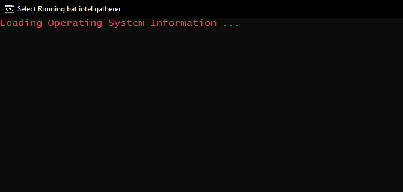
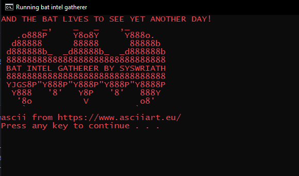

# Bat-Intel-Gatherer

<h2>Introduction</h2>

 <b>BAT Intel Gatherer</b> is a batch script file that runs a set of given commands and compiles the information gathered into one <b>.txt</b> file. 

 It runs on any device that is capable of executing a batch script (i.e. <b>Windows ONLY</b>). You can even run it from a <b>portable device</b>. 

 Please note that it is important to <b>run the batch file in a folder of its own</b>. If not, make sure there aren't any <b>.txt</b> files in the directory, as it can interefere with the output file. 

<h2>Features</h2>

<b>1.</b> (ipconfig) Network adapter info & Private IP

<b>2.</b> (nslookup myip.opendns.com resolver1.opendns.com) Public IP

<b>3.</b> (netsh wlan show profiles) Network Profiles ('profile name=' doesn't work on portable devices when trying to export, but is displayed on the screen when run through cmd itself.)

<b>4.</b> (netstat -aon) Internal port scan with PID

<b>5.</b> (systeminfo) System info (hardware, ownership, network card, etc)

<b>6.</b> (net user) User Account info

<h2>How to run</h2>

Either you can <b>download</b> this repository, or you can <b>copy paste</b> the batch script code in <b>Notepad</b>, and save the file with a <b>.bat</b>

<b>1.</b> Click on the batch file. Run it as <b>administrator</b> if you prefer.

<b>2.</b> The file will run. Let it.

<b>3.</b> When you see the ASCII banner, the process has ended. Press any key to exit.

<b>4.</b> There will be another file in the directory where the batch file is located, named "<b>systeminfo.txt</b>". Open this file to find the intel.

